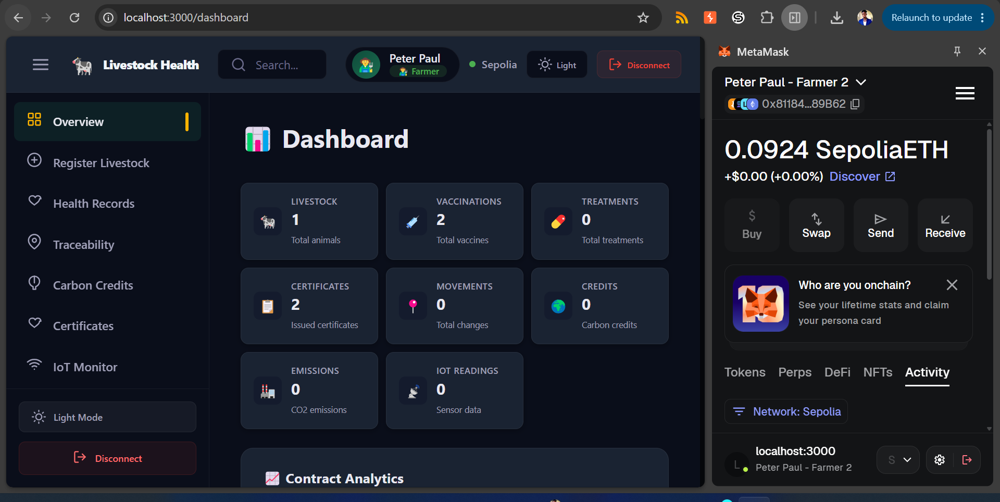
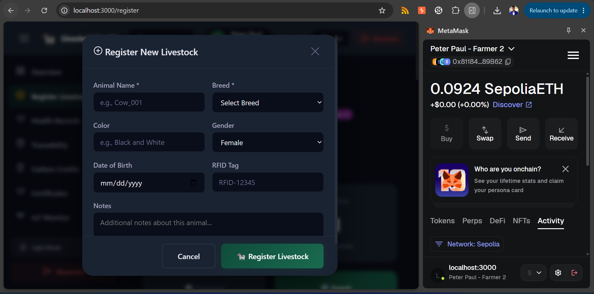
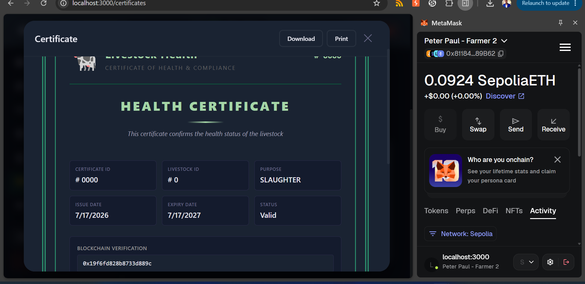
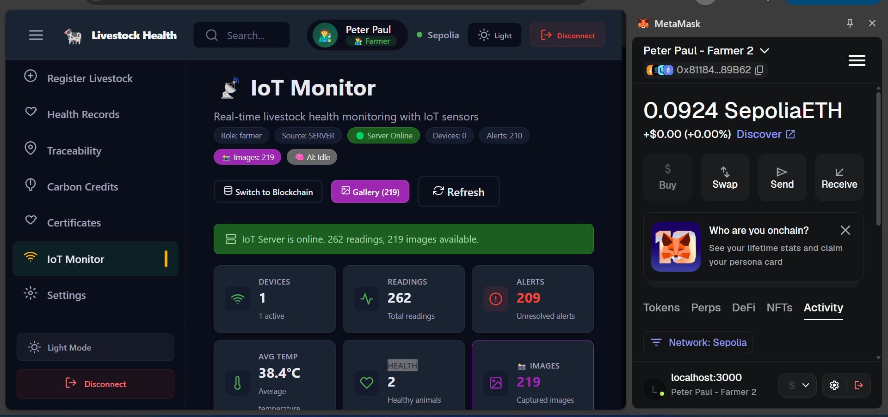
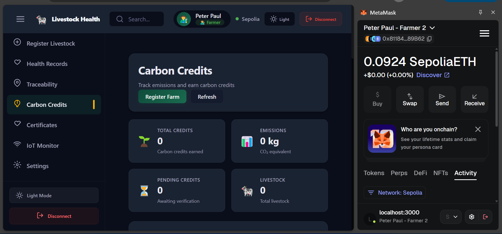

# 🐄 Blockchain-Based Smart Livestock Health System

*A decentralized platform combining blockchain, IoT sensors, and AI for real-time livestock health monitoring, traceability, and management.*

---

## 👥 Team Members

| Name | Roll Number |
|------|-------------|
| **Jerry Dorlopia** | #202540686 |
| **PATCHANNE DJONG-IGNABE EPHRAIM** | #202651930 |

---

## 📚 Table of Contents

- [Overview](#-overview)
- [Features](#-features)
- [Screenshots](#-screenshots)
- [System Architecture](#-system-architecture)
- [Technologies Used](#-technologies-used)
- [Deployment](#-deployment)
- [Installation](#-installation)
- [Usage](#-usage)
- [User Manual](#-user-manual)
- [License](#-license)

---

## 📋 Overview

The **Blockchain-Based Smart Livestock Health System** is a comprehensive decentralized platform that revolutionizes livestock management by combining blockchain technology, IoT sensors, and artificial intelligence. This system provides farmers, veterinarians, and regulators with real-time access to animal health data, complete traceability from birth to slaughter, and AI-powered health predictions.

### Problem Statement

Traditional livestock management faces significant challenges that impact productivity, animal welfare, and food safety:

- **Lack of transparency** in animal health records makes it difficult to track disease outbreaks and verify treatment history
- **Inefficient traceability** from farm to market creates gaps in the supply chain and reduces consumer trust
- **Delayed disease detection** leads to rapid spread of illnesses, causing significant economic losses
- **Manual record-keeping** is prone to errors, fraud, and data loss
- **No real-time monitoring** of animal health parameters delays critical interventions

### Our Solution

Our system addresses these challenges through:

- **Immutable health records** stored on the Ethereum blockchain, ensuring data integrity and transparency
- **Real-time IoT monitoring** of vital signs including temperature, activity, and feeding behavior
- **AI-powered health prediction** using computer vision and sensor data analysis
- **Full traceability** from birth to slaughter with complete movement and ownership history
- **Automated alerts** for abnormal conditions, enabling early intervention
- **Transparent sales & ownership** tracking with smart contract automation
- **Carbon credit tracking** for sustainable farming practices

---

## ✨ Features

### Backend Features

| Feature | Description | Status |
|---------|-------------|--------|
| **Smart Contracts** | Solidity-based contracts for livestock management on Ethereum | ✅ |
| **IoT Data Ingestion** | REST API for receiving and processing ESP32 sensor data | ✅ |
| **Image Storage** | Centralized file storage for captured livestock images | ✅ |
| **AI Integration** | TensorFlow-based health prediction models | 🚧 |
| **Blockchain Gateway** | Event listeners and transaction handling for blockchain interaction | ✅ |
| **Data Persistence** | JSON-based storage for readings, alerts, and system data | ✅ |
| **Alert System** | Automated alert generation for abnormal health conditions | ✅ |

### Frontend Features

| Feature | Description | Status |
|---------|-------------|--------|
| **Dashboard** | Real-time statistics and analytics with interactive charts | ✅ |
| **Livestock Registry** | Register, list for sale, purchase, and transfer animals | ✅ |
| **Health Records** | Manage vaccinations, treatments, and health certificates | ✅ |
| **Traceability** | Track animal movements, slaughter records, and sale history | ✅ |
| **IoT Monitor** | Live sensor data visualization with image gallery | ✅ |
| **Carbon Credits** | Emissions tracking, verification, and credit management | ✅ |
| **Role Management** | Admin, Farmer, Veterinarian, Regulator, and Slaughterhouse roles | ✅ |

---

## 📸 Screenshots

### Dashboard Overview



*Real-time statistics and analytics dashboard showing livestock counts, health status, and system metrics.*

### Livestock Registry



*Register new animals, view herd details, and manage livestock information.*

### Health Records



*Manage vaccinations, treatments, and health certificates for each animal.*

### Traceability


*Complete animal journey tracking from farm to market with movement history.*

### IoT Monitor



*Live sensor readings, AI-powered health analysis, and image gallery.*

### Carbon Credits



*Track carbon emissions and manage verified credits for sustainable farming.*

---

## 🏗️ System Architecture

### System Architecture Diagram
┌─────────────────────────────────────────────────────────────────────────────┐
│ FRONTEND (React.js) │
│ ┌──────────┐ ┌──────────┐ ┌──────────┐ ┌──────────┐ ┌──────────────┐ │
│ │Dashboard │ │Livestock │ │ Health │ │Traceability│ │IoT Monitor │ │
│ │ │ │Registry │ │Records │ │ │ │ │ │
│ └──────────┘ └──────────┘ └──────────┘ └──────────┘ └──────────────┘ │
└─────────────────────────────────┬─────────────────────────────────────────┘
│
▼
┌─────────────────────────────────────────────────────────────────────────────┐
│ BACKEND (Node.js + Express) │
│ ┌──────────┐ ┌──────────┐ ┌──────────┐ ┌──────────┐ ┌──────────────┐ │
│ │ IoT API │ │Image │ │ AI │ │Blockchain│ │ Data │ │
│ │ │ │Storage │ │Analysis │ │ Gateway │ │ Storage │ │
│ └──────────┘ └──────────┘ └──────────┘ └──────────┘ └──────────────┘ │
└─────────────────────────────────┬─────────────────────────────────────────┘
│
┌─────────────┼─────────────┐
▼ ▼ ▼
┌─────────────────┐ ┌─────────────┐ ┌─────────────────┐
│ Blockchain │ │ IPFS/File │ │ AI Models │
│ (Sepolia) │ │ Storage │ │ (TensorFlow) │
│ │ │ │ │ │
│ Smart Contracts │ │ Images │ │ Health │
│ │ │ & Data │ │ Predictions │
└─────────────────┘ └─────────────┘ └─────────────────┘
▲
│
┌─────────────────────────────────────────────────────────────────────────────┐
│ IoT DEVICES (ESP32-CAM) │
│ ┌──────────┐ ┌──────────┐ ┌──────────┐ ┌──────────┐ ┌──────────────┐ │
│ │ PIR │ │Ultrasonic│ │ Camera │ │ Sound │ │ WiFi │ │
│ │ Sensor │ │ Sensor │ │ │ │ Sensor │ │ Module │ │
│ └──────────┘ └──────────┘ └──────────┘ └──────────┘ └──────────────┘ │
└─────────────────────────────────────────────────────────────────────────────┘

text

*The system architecture shows the interaction between frontend, backend, blockchain, and IoT components.*

### Data Flow Diagram (DFD)
┌─────────────────────────────────────────────────────────────────────────────┐
│ DATA FLOW │
├─────────────────────────────────────────────────────────────────────────────┤
│ │
│ ESP32-CAM │
│ │ │
│ ▼ │
│ ┌─────────────────┐ ┌─────────────────┐ ┌─────────────────┐ │
│ │ Sensor Data │────▶│ Server API │────▶│ Data Storage │ │
│ │ - Temperature │ │ (Node.js) │ │ - readings.json│ │
│ │ - Distance │ │ - Validate │ │ - alerts.json │ │
│ │ - Activity │ │ - Process │ │ - images/ │ │
│ │ - Images │ │ - Store │ │ │ │
│ └─────────────────┘ └─────────────────┘ └─────────────────┘ │
│ │ │ │
│ ▼ ▼ │
│ ┌─────────────────┐ ┌─────────────────┐ │
│ │ Blockchain │ │ Frontend │ │
│ │ - Alerts │ │ - Dashboard │ │
│ │ - Health │ │ - Charts │ │
│ │ - Records │ │ - Gallery │ │
│ └─────────────────┘ └─────────────────┘ │
│ │
└─────────────────────────────────────────────────────────────────────────────┘

text

*Data flow diagram showing how sensor data moves from IoT devices through the server to storage, blockchain, and frontend.*

---

## 🛠️ Technologies Used

### Blockchain

| Technology | Version | Purpose |
|------------|---------|---------|
| **Solidity** | 0.8.19 | Smart contract development |
| **Ethers.js** | 5.7.2 | Blockchain interaction and transaction handling |
| **Hardhat** | 2.13.0 | Development, testing, and deployment |
| **Sepolia** | - | Ethereum testnet for deployment |

### Frontend

| Technology | Version | Purpose |
|------------|---------|---------|
| **React** | 18.2.0 | UI framework for building the dashboard |
| **Recharts** | 3.9.2 | Data visualization and charting |
| **React Router** | 6.8.0 | Navigation and routing |
| **Vite** | 4.0.0 | Build tool and development server |
| **React Feather** | 2.0.10 | Icon library |

### Backend

| Technology | Version | Purpose |
|------------|---------|---------|
| **Node.js** | 18.x | Runtime environment |
| **Express** | 4.22.2 | REST API framework |
| **Cors** | 2.8.6 | Cross-origin resource sharing |
| **ArduinoJson** | - | JSON parsing for ESP32 |
| **Base64** | - | Image encoding and decoding |

### IoT

| Component | Purpose |
|-----------|---------|
| **ESP32-CAM** | Main microcontroller with camera |
| **PIR Sensor** | Motion detection for activity monitoring |
| **Ultrasonic Sensor** | Distance measurement for feeding behavior |
| **Sound Sensor** | Abnormal sound detection for respiratory issues |
| **Camera Module** | Image capture for AI analysis |

### AI & Machine Learning

| Technology | Purpose |
|------------|---------|
| **TensorFlow** | Model training and inference |
| **Teachable Machine** | Quick model prototyping |
| **Computer Vision** | Image-based health assessment |

---

## 🚀 Deployment

### Smart Contract Addresses (Sepolia)

| Contract | Address | Explorer |
|----------|---------|----------|
| **LivestockRegistry** | `0x224378097061ca4d01caF4Aa65140eFeA1cdD47c` | [View](https://sepolia.etherscan.io/address/0x224378097061ca4d01caF4Aa65140eFeA1cdD47c) |
| **TraceabilityManager** | `0xBe13e026AA517ff510815f0260b7bf094CdFC1Af` | [View](https://sepolia.etherscan.io/address/0xBe13e026AA517ff510815f0260b7bf094CdFC1Af) |
| **HealthRecord** | `0x9180e5c50E1fc04295F50Fd5709e51629926D3e9` | [View](https://sepolia.etherscan.io/address/0x9180e5c50E1fc04295F50Fd5709e51629926D3e9) |
| **IoTHealthMonitor** | `0x95c83EBaF7481dC76f2c08fA3Ee5b1260AE26242` | [View](https://sepolia.etherscan.io/address/0x95c83EBaF7481dC76f2c08fA3Ee5b1260AE26242) |
| **CarbonCreditTracker** | `0xD5731c1320fF9925f225a91E15e0DB4C4213A4F9` | [View](https://sepolia.etherscan.io/address/0xD5731c1320fF9925f225a91E15e0DB4C4213A4F9) |

### Deployment Commands

```bash
# Deploy Smart Contracts
npx hardhat run scripts/deploy.js --network sepolia

# Start Frontend Development Server
npm run dev

# Start Backend Server
npm run server

# Run Both Frontend and Backend
npm run dev:all

# Build for Production
npm run build

# Preview Production Build
npm run preview
Environment Variables
env
# Blockchain Configuration
SEPOLIA_RPC_URL=https://sepolia.infura.io/v3/YOUR_INFURA_KEY
PRIVATE_KEY=YOUR_PRIVATE_KEY
ETHERSCAN_API_KEY=YOUR_ETHERSCAN_KEY

# Server Configuration
PORT=3001
API_SECRET=YOUR_API_SECRET
NODE_ENV=development

# AI Configuration
AI_MODEL_PATH=./models/livestock_model.h5
TEACHABLE_MACHINE_URL=https://teachablemachine.withgoogle.com/models/YOUR_MODEL/

# IPFS Configuration (Optional)
IPFS_ENDPOINT=https://ipfs.infura.io:5001
IPFS_PROJECT_ID=YOUR_PROJECT_ID
IPFS_PROJECT_SECRET=YOUR_PROJECT_SECRET
🔧 Installation
Prerequisites
Node.js 18+ installed

MetaMask or compatible Web3 wallet

ESP32-CAM (optional for IoT features)

Sepolia ETH for contract deployment

Step-by-Step Installation
Clone the Repository

bash
git clone https://github.com/yourusername/livestock-dapp.git
cd livestock-dapp
Install Dependencies

bash
npm install
Setup Environment Variables

bash
cp .env.example .env
# Edit .env with your configuration values
Compile Smart Contracts

bash
npx hardhat compile
Deploy Smart Contracts

bash
npx hardhat run scripts/deploy.js --network sepolia
Update Contract Addresses

Update the contract addresses in src/utils/contracts.js with your deployed addresses.

Start the Application

bash
npm run dev:all
Access the Application

Frontend: http://localhost:3000

Backend API: http://localhost:3001/api/iot

📖 Usage
User Roles and Permissions
Role	Permissions
Admin	Full system access, manage users, approve registrations, view all data
Farmer	Register livestock, record health, sell animals, view IoT data
Veterinarian	Add health records, issue certificates, resolve alerts, view IoT data
Regulator	View traceability, verify compliance, audit records
Slaughterhouse	Record slaughter, view animal history, update records
Quick Actions
For Farmers
Register Livestock

javascript
// Using the DApp interface
1. Navigate to Livestock Registry
2. Click "Register Livestock"
3. Enter name, breed, and other details
4. Confirm transaction
List Animal for Sale

javascript
1. Select animal from herd
2. Click "Sell"
3. Enter price in ETH
4. Confirm transaction
Record Movement

javascript
1. Navigate to Traceability
2. Click "Record Movement"
3. Select animal and enter details
4. Confirm transaction
For Veterinarians
Add Vaccination Record

javascript
1. Go to Health Records
2. Select animal
3. Click "Add Vaccination"
4. Enter vaccine name, batch, and date
5. Confirm transaction
Resolve Alerts

javascript
1. View IoT Monitor
2. Review active alerts
3. Click "Resolve" on verified alerts
4. Confirm action
IoT Monitor Usage
View Live Data

javascript
1. Navigate to IoT Monitor
2. View real-time sensor readings
3. Click "Refresh" for latest data
Analyze with AI

javascript
1. Select an image from the gallery
2. Click "Analyze with AI"
3. View health predictions
4. Review confidence scores
📖 User Manual
https://images/manual.png

Comprehensive user guide for the Livestock Health System

Manual Contents
Getting Started - Installation and setup guide

User Registration - How to register as a farmer, vet, or regulator

Livestock Management - Registering, selling, and transferring animals

Health Records - Managing vaccinations, treatments, and certificates

Traceability - Tracking animal movements and sale history

IoT Monitoring - Connecting devices and viewing sensor data

AI Health Analysis - Using AI for health predictions

Carbon Credits - Tracking emissions and managing credits

Troubleshooting - Common issues and solutions

Quick Reference Guide
Action	Page	Steps
Register Animal	Livestock Registry	3 steps
Add Vaccination	Health Records	4 steps
Record Movement	Traceability	3 steps
View IoT Data	IoT Monitor	2 steps
Analyze with AI	IoT Monitor	3 steps
📄 Download User Manual (PDF)

✅ Best Practices Followed
Clear hierarchy with proper header structure (#, ##, ###)

Visual elements with emojis for better readability

Structured information using tables, lists, and code blocks

Links to external resources and internal sections

Professional presentation with consistent formatting

Documentation with comprehensive user guide

Security with environment variables for sensitive data

Version control with proper .gitignore configuration

📄 License
This project is licensed under the MIT License - see the LICENSE file for details.

🙏 Acknowledgments
Ethereum - Smart contract platform

ESP32 - IoT hardware

TensorFlow - Machine learning

React - Frontend framework

Hardhat - Development environment

OpenZeppelin - Smart contract libraries

📞 Contact & Support
📧 Email	support@livestock-dapp.com
🐦 Twitter	@LivestockDapp
💬 Discord	Join Community
📚 Docs	docs.livestock-dapp.com
🐛 Issues	GitHub Issues
⭐ Star History
https://api.star-history.com/svg?repos=yourusername/livestock-dapp&type=Date

<div align="center">
Made with ❤️ for the global livestock community

⬆ Back to Top
